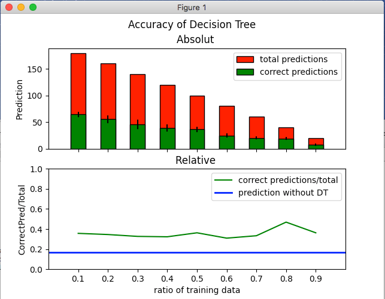
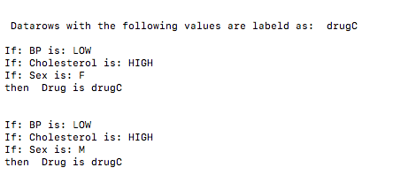

# DecisionTree
##### Implementation of a decision tree build with ID3-Algorithm and visualization of correctly classified data.

1. Introduction
2. Structure
3. Requirements
4. Functionalities
5. Troubleshootings
6. Examples
7. Sources

## 1. Introduction
In this Project I implemented an ID3 algorithm to train a decision tree.
Additionally I visualize how accurately the resulting decision tree
labels the data correctly compared to the probability of labelling correctly by chance.

My motivation was to improve my understanding of this categorization method
and to learn how to manipulate the training of a decision tree to increase the accuracy.

#### What is the ID3
The ID3-algorithm creates a decision tree by analyzing a trainingset.

-> For more information:  https://en.wikipedia.org/wiki/ID3_algorithm 

## 2.Structure

### input format:

1) data-set with N-1 first data as features and the last column as Labels
2) kwargs to specify the training and evaluation properties    

      ##### Data requirenments
      - The datamust be stored in a .csv file
      - The data for the analysis of the prediction accuracy must be labeld
      - The label must be in the last column -> change the order
      - The data has no Index for the Columns -> no Problem, "prepare_data.prepare()" takes care of this issue

The implementation is structured in a main document that contains the main function
and calls a function to calculate the mean and standart deviation of

## 3. Requirenments

Before you start, check if you have all the packages listed in requirements.txt

if not, you can run:

    $ pip install -r requirements.txt

then you should clone the repoitory and open the folder in your terminal

## 4.Functionalities

You can test the implementation by just using the command `python main.py` and see how it works by default.
By default the implementation calculates the mean and standart deviation for the number of correctly labeld data various trials.
A trial includes preparing the data, training a tree and counting the ammount of correct predictions.
This is done for different sets of training and test data and presented in a diagram.

#### Plot the number of correct prediction

#### Change values
You can change values in the main.py document.
You can also use differnt data files or try to  use your own data (but have a look at the Data requirenments in the Imput format section).

 You can change for example values, to manipulate how the tree is trained:
- max_branching
- max_depth
- ratio_list 

Which data is compared:
- ratio_list
- trial

-> further idea: possibility to compare data by different max_branching()/max_depth()

You can also print for more trasparency :
An additional feature for more trasparency is the possibility to print every possible combination of values that lead to a certain label (Decision_Tree.print_t).
This allows to understand why certain data is labeld.
- print_label

For more information have a look at the Documentation of main.

#### Documentation of main:
main(df, print_label=None, has_col_index=True, max_branching=5, max_depth =4 ;trials=4, ratio_list=[.1,.2,.3,.4,.5,.6,.7,.8,.9 ])

         
            df : 2-dimensional array
                Used to train and test the decision tree
                
            print_label : string
                The label for which all possible value combination should be printed in the terminal.
                Otherwise nothing is printed

            has_col_index: bool
                If False, a numerical column index is added to the data-frame (only necessary to  apply "Decision_Tree.print_tree")

            max_branching: int
                Influences the training of the decision tree.
                Limits the branching of the tree, i.e. with a factor of 5, each node can have a maximum of 5 children.

            max_depth: int
              Influences the training of the decision tree.
              Limits the depth of the tree, so after a certain depth the label is calculated
              by the remaining data without a further split.

            trials: int
                Determines from how many trained and tested trees the value/mean and the standard deviation
                per type (in this version only ratio of testing and training data-ratio) is determined.

                The default value is low to reduce the runtime during trying out new features and demonstration.

            ratio_list: list
                 Influences the training of the decision tree.
                 A list of the ratio between training- and testing set.
                 For each value the program runs some trials and calculates the mean and standard deviati´

## 5. Probems and Troubleshootings

#### Problems with data and (not optimal) solutions
Some Problems occur when working with DecisionTrees.
I implemented solutions for those which might be suboptimal and other solutions
would increase the accuracy of the Decision tree.

- Test-datarow has value which was not part of the training datarow
-> assume data would have random value of values given in the trainingset (Decision_Node._classify())

- Training data has equal distribution of data with different Labels
-> choose the first one (Label_Leaf.__init__)

- Data-column has to many different values:
  if they are numerical: create scopes
  else: just do not allow a split by the values of this column
  
## 6. Interpretation
There does not seem to be a significant differnce: Hoeever, we can see that labeling data with a Decision tree bulid by an ID3-algorithm is better in predicting a label as just randomly chosing a label

